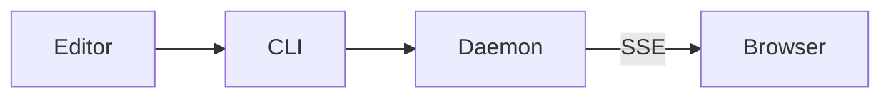

# Heading level 1

A paragraph of body text, here to show the base font, its size and its line
height. It carries **bold**, _italic_, ~~struck through~~ and `inline code`
runs, an [internal link](#heading-level-2), a bare URL that linkify turns into
a link — https://example.com — and a long enough run of 日本語のテキスト to
check that the fallback font stack and line height hold up in mixed scripts.

## Heading level 2

### Heading level 3

#### Heading level 4

##### Heading level 5

###### Heading level 6

## Lists

- First item
- Second item, long enough to wrap onto a second line so that the hanging
  indent of the marker can be judged
  - Nested item
    - Twice nested item
- Third item

1. Ordered item
2. Ordered item
   1. Nested ordered item
3. Ordered item

- [x] A completed task
- [ ] An outstanding task, also long enough to wrap so the checkbox alignment
      against the wrapped line is visible

## Quotes

> A block quote. It gets a left border and muted text.
>
> > And a nested one inside it.

## Code

```javascript
// Highlighted: javascript is one of the loaded languages.
export function greet(name) {
  const greeting = `Hello, ${name}!`;
  return greeting.length > 0 ? greeting : null;
}
```

```rust
fn main() {
    let items: Vec<u32> = (0..10).filter(|n| n % 3 == 0).collect();
    println!("{items:?}");
}
```

```shell
$ mop README.md --line 42
```

```python
# Not a loaded language: falls back to a plain, unhighlighted block.
def greet(name: str) -> str:
    return f"Hello, {name}!"
```

```
A fence with no language at all. The line that follows is deliberately too wide for the column, so that horizontal scrolling inside the block can be checked.
```

## Table

| Column | Type | Notes |
| --- | --- | --- |
| `id` | string | The document id |
| `line` | number | 1-based, as everywhere outside markdown-it |
| `viewportRatio` | number | Where in the viewport the line lands |

## Images


## Diagrams



A diagram that does not parse keeps showing its source, with an error border:

```mermaid
flowchart LR
  this is not a diagram ]]]
```

## Rules

Above the rule.

---

Below the rule.
